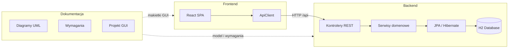

# ScoutForce

**ScoutForce** to system wspierający pracę skautów koszykarskich w kontekście ligi NBA. Uporządkowuje cykl obserwacji zawodników — od przeglądu listy obserwowanych graczy, przez analizę meczów i statystyk, po tworzenie raportów skautingowych z wielowymiarowymi ocenami i rekomendacją draftową.

Projekt składa się z trzech głównych elementów:

| Element | Ścieżka | Technologie |
|---------|---------|-------------|
| [Dokumentacja](#-dokumentacja) | [`docs/`](docs/) | Typst, UML, Python |
| [Backend](#-backend) | [`backend/`](backend/) | Java 17, Spring Boot 3, JPA, H2 |
| [Frontend](#-frontend) | [`frontend/`](frontend/) | React 18, TypeScript, Vite, Tailwind CSS |

---

## Spis treści

- [Architektura](#architektura)
- [Szybki start](#szybki-start)
- [Dokumentacja](#-dokumentacja)
- [Backend](#-backend)
- [Frontend](#-frontend)
- [Struktura repozytorium](#struktura-repozytorium)
- [Przypadki użycia](#przypadki-użycia)

---

## Architektura

Aplikacja działa w modelu klient–serwer: frontend (SPA) komunikuje się z backendem przez REST API. Dane biznesowe są utrwalane w osadzonej bazie H2. Dokumentacja projektowa opisuje model domeny i przepływy niezależnie od warstwy implementacyjnej.



---

## Szybki start

### Wymagania

- **Java 17+** i Maven (lub wrapper `./mvnw` w katalogu `backend/`)
- **Node.js 18+** i npm
- *(opcjonalnie, do dokumentacji)* [Typst](https://typst.app/) i Python 3

### 1. Uruchom backend

```bash
cd backend
./mvnw spring-boot:run
```

Serwer startuje na `http://localhost:8080`. Konsola H2: `http://localhost:8080/h2-console` (JDBC URL: `jdbc:h2:file:./data/scoutforce`).

### 2. Uruchom frontend

```bash
cd frontend
npm install
npm run dev
```

Aplikacja dostępna pod adresem wskazanym przez Vite (domyślnie `http://localhost:5173`). Adres API konfiguruje się zmienną `VITE_API_BASE_URL` w pliku `frontend/.env` (domyślnie `http://localhost:8080`).

### 3. Wygeneruj dokumentację PDF *(opcjonalnie)*

```bash
cd docs/mas-dokumentacja
python compile_docs.py
```

---

## 📄 Dokumentacja

**Ścieżka:** [`docs/`](docs/)

Dokumentacja projektowa została przygotowana w ramach przedmiotu MAS (Modelowanie i Analiza Systemów) i stanowi formalny opis systemu ScoutForce — od wymagań użytkownika po implementacyjny diagram klas i projekt interfejsu.

### Zawartość

| Plik / katalog | Opis |
|----------------|------|
| [`docs/mas-dokumentacja/`](docs/mas-dokumentacja/) | Główna dokumentacja projektowa w formacie [Typst](https://typst.app/) |
| [`docs/mas-dokumentacja/main.typ`](docs/mas-dokumentacja/main.typ) | Plik główny łączący wszystkie rozdziały |
| [`docs/mas-dokumentacja/contents/`](docs/mas-dokumentacja/contents/) | Poszczególne rozdziały dokumentacji |
| [`docs/mas-dokumentacja/assets/`](docs/mas-dokumentacja/assets/) | Diagramy UML (SVG) i zrzuty ekranu GUI |
| [`docs/mas-dokumentacja/compile_docs.py`](docs/mas-dokumentacja/compile_docs.py) | Skrypt kompilacji do PDF |
| [`docs/requirements/`](docs/requirements/) | Wytyczne i checklista wymagań dokumentacyjnych MAS |

### Rozdziały dokumentacji

1. **Wprowadzenie** — dziedzina problemowa, cel systemu, użytkownicy (`Scout`, `Director`), konwencje nazewnictwa
2. **Wymagania użytkownika** — historyjki użytkownika opisujące pracę skauta i dyrektora sportowego
3. **Diagramy przypadków użycia** — wymagania funkcjonalne w notacji UML
4. **Wymagania niefunkcjonalne** — wydajność, technologia, użyteczność
5. **Analityczny diagram klas** — model pojęciowy domeny (12–15 klas biznesowych)
6. **Projektowy diagram klas** — model implementacyjny z metodami wynikłymi z analizy dynamicznej
7. **Scenariusz przypadku użycia** — szczegółowy scenariusz nietrywialnego UC z relacjami `«include»` / `«extend»`
8. **Diagram aktywności** — graficzna forma wybranego scenariusza
9. **Diagram stanu** — zmiany stanu wybranej klasy (np. status zawodnika)
10. **Projekt GUI** — makiety interfejsu z nawigacją po asocjacji wiele-do-wielu (`Scout` → `Player` → `Match`)
11. **Omówienie decyzji projektowych** — uzasadnienie wyborów architektonicznych i skutki analizy dynamicznej

### Zadania dokumentacji

- **Modelowanie domeny** — opisanie świata skautingu NBA: zawodnicy, kluby, mecze, statystyki, raporty, delegacje, analizy strzeleckie, ranking draftowy (Big Board)
- **Analiza statyczna i dynamiczna** — diagramy UML zgodne z notacją, czytelne w formacie A4
- **Projekt interfejsu** — makietki ekranów odzwierciedlające przepływ `View Players List` → `View Player's Matches` → `Create Scouting Report`
- **Most do implementacji** — projektowy diagram klas jest bezpośrednią podstawą modelu JPA w backendzie i przepływów w frontendzie
- **Kompilacja do PDF** — skrypt `compile_docs.py` generuje plik `MAS_16c_Betlej_Filip_s30331.pdf` zgodnie z wymaganiami organizacyjnymi

---

## ⚙️ Backend

**Ścieżka:** [`backend/`](backend/)

Backend to serwis REST oparty na **Spring Boot 3** i **Spring Data JPA**. Odpowiada za logikę biznesową, walidację reguł domenowych, persystencję danych oraz udostępnianie API dla frontendu.

### Stos technologiczny

- Java 17
- Spring Boot 3.3 (Web, Data JPA, Validation, DevTools)
- Hibernate + H2 (baza plikowa w `./data/scoutforce`)
- Lombok

### Warstwy aplikacji

```
backend/src/main/java/pl/s30331/ScoutForce/
├── controller/          # REST API + DTO
├── service/             # Logika przypadków użycia
├── model/               # Encje JPA i enumy domenowe
├── repository/          # Repozytoria Spring Data
├── exception/           # GlobalExceptionHandler
└── DataInitializer.java   # Dane startowe (demo scout, zawodnicy, mecze)
```

### Model domeny

Główne klasy biznesowe (zgodne z dokumentacją):

| Klasa | Odpowiedzialność |
|-------|------------------|
| `Person` | Klasa bazowa dla osób w systemie |
| `Scout` | Skaut — obserwuje mecze, tworzy raporty |
| `Director` | Dyrektor sportowy — zarządza delegacjami |
| `Club` | Klub koszykarski |
| `Player` | Zawodnik ze statusem w procesie skautingowym |
| `Match` | Mecz z wynikiem i uczestnikami |
| `MatchStats` | Statystyki box-score zawodnika w meczu |
| `ScoutingReport` | Raport skautingowy z oceną końcową |
| `DetailedRating` | Ocena szczegółowa w ramach raportu |
| `Delegation` | Delegacja skautingowa na mecz |
| `ShootingAnalysis` | Analiza strzelecka per strefa boiska |
| `UniversityExperience` / `ProfessionalExperience` | Doświadczenie zawodnika |

### Zadania backendu

#### 1. Udostępnianie REST API

| Endpoint | Metoda | Opis |
|----------|--------|------|
| `/api/scouts/default` | GET | Identyfikacja demo skauta (`SCT-001`) |
| `/api/scouts/{scoutId}/players` | GET | Lista zawodników obserwowanych przez skauta |
| `/api/scouts/{scoutId}/players/{playerId}/matches` | GET | Mecze zawodnika widziane przez skauta (204 gdy brak) |
| `/api/scouts/{scoutId}/players/{playerId}/reports` | POST | Utworzenie raportu (wszystkie obserwowane mecze) |
| `/api/scouts/{scoutId}/players/{playerId}/reports/from-matches` | POST | Utworzenie raportu z wybranego podzbioru meczów (flow A1) |
| `/api/players` | GET | Wszystkie zawodnicy z globalnymi KPI |
| `/api/players/{playerId}` | GET | Szczegóły zawodnika |
| `/api/players/{playerId}/reports` | GET | Raporty skautingowe zawodnika |

#### 2. Realizacja przypadków użycia

- **`View Players List`** — `ViewPlayersListService` nawiguje asocjacjami skauta i zwraca zawodników, których skaut obserwował w co najmniej jednym meczu
- **`View Player's Matches`** — `ViewPlayerMatchesService` przecina mecze obserwowane przez skauta z meczami zawodnika
- **`Create Scouting Report`** — `ScoutingReportService` tworzy raport, waliduje dane wejściowe, oblicza `finalRating` i aktualizuje status zawodnika
- **`Add Detailed Ratings`** — oceny szczegółowe są częścią tworzenia raportu (kompozycja w `ScoutingReport`)

#### 3. Reguły biznesowe

- **E1** — próba utworzenia raportu dla zawodnika bez obserwowanych meczów zwraca HTTP 422 z komunikatem *"Chosen player has no matches you've observed."*
- **Obliczanie oceny** — `finalRating` jest wyliczany po stronie serwera na podstawie ocen szczegółowych; frontend traktuje tę wartość jako źródło prawdy
- **KPI** — średnie statystyk box-score (MIN, PTS, REB, AST, STL, BLK) liczone w kontrolerze przez nawigację asocjami, bez filtrowania po kluczach obcych

#### 4. Persystencja i dane startowe

- Baza H2 zapisuje dane w pliku `./data/scoutforce` (trwałość między restartami)
- `DataInitializer` wypełnia bazę danymi demonstracyjnymi przy pierwszym uruchomieniu
- Hibernate `ddl-auto=update` synchronizuje schemat z encjami

#### 5. Obsługa błędów

- `GlobalExceptionHandler` mapuje wyjątki domenowe na spójne odpowiedzi JSON (`ApiErrorDto`) z kodami HTTP

### Uruchomienie i testy

```bash
cd backend
./mvnw spring-boot:run          # uruchomienie aplikacji
./mvnw test                     # testy jednostkowe
```

---

## 🖥️ Frontend

**Ścieżka:** [`frontend/`](frontend/)

Frontend to jednostronicowa aplikacja (**SPA**) zbudowana w **React** i **TypeScript**. Odwzorowuje projekt GUI z dokumentacji — dwupanelowy układ z listą zawodników po lewej i dynamiczną treścią po prawej.

### Stos technologiczny

- React 18 + TypeScript
- Vite (bundler i dev server)
- Tailwind CSS (stylowanie)
- Lucide React (ikony)

### Struktura kodu

```
frontend/src/
├── App.tsx                 # Orkiestrator widoków i stanu aplikacji
├── api/
│   ├── client.ts           # Klient HTTP (fetch + timeout)
│   ├── adapters.ts         # Mapowanie DTO → typy UI
│   ├── dto.ts              # Typy odpowiedzi backendu
│   └── config.ts           # URL API i stałe demo
├── components/             # Komponenty widoków i UI
│   ├── PlayerListItem.tsx      # Element listy zawodników (Pane A)
│   ├── PlayerDetailView.tsx    # Szczegóły zawodnika + KPI
│   ├── PlayerMatchesView.tsx   # Lista meczów z wyborem podzbioru (A1)
│   ├── CreateReportView.tsx    # Formularz raportu skautingowego
│   ├── ReportSuccessView.tsx   # Potwierdzenie zapisu raportu
│   ├── MatchCard.tsx           # Karta meczu ze statystykami
│   ├── DetailedRatingRow.tsx   # Wiersz oceny szczegółowej
│   ├── RecommendationCard.tsx# Wybór rekomendacji draftowej
│   ├── KPITile.tsx / StatChip.tsx  # Wizualizacja statystyk
│   ├── Modal.tsx               # Dialog anulowania raportu
│   ├── Toast.tsx               # Powiadomienia
│   └── EmptyState.tsx          # Stany puste / ładowanie / błąd
└── types/domain.ts         # Typy UI (UiPlayer, UiMatch, View, …)
```

### Maszyna stanów widoków

Frontend realizuje przepływ opisany w dokumentacji GUI:

```
players → player-detail → player-matches → create-report → report-success
                ↑______________________________________________|
```

| Widok | Komponent | Opis |
|-------|-----------|------|
| `players` | `EmptyState` | Stan początkowy — zachęta do wyboru zawodnika z listy |
| `player-detail` | `PlayerDetailView` | Profil zawodnika, KPI, przyciski „View Matches” i „Create Report” |
| `player-matches` | `PlayerMatchesView` | Mecze obserwowane przez skauta; wybór podzbioru (flow A1) |
| `create-report` | `CreateReportView` | Formularz: notatka, rekomendacja, oceny szczegółowe |
| `report-success` | `ReportSuccessView` | Podsumowanie z `finalRating` z backendu |

### Zadania frontendu

#### 1. Prezentacja danych

- Wyświetlanie listy zawodników obserwowanych przez zalogowanego skauta (asocjacja `Scout` → `Player`)
- Po wyborze zawodnika — szczegóły, średnia ocena i KPI z ostatnich obserwacji
- Po przejściu do meczów — lista meczów z box-score (asocjacja `Player` → `Match`)

#### 2. Interakcja użytkownika

- Nawigacja między widokami z zachowaniem kontekstu (wybrany zawodnik, wybrane mecze)
- Wielokrotny wybór meczów (checkboxy) dla flow A1
- Formularz raportu z walidacją po stronie klienta przed wysłaniem
- Dialog potwierdzenia przy anulowaniu edycji raportu

#### 3. Komunikacja z API

- `ApiClient` opakowuje `fetch` z timeoutem 30 s i obsługą `204 No Content`
- Warstwa adapterów (`adapters.ts`) tłumaczy DTO backendu na typy UI — frontend nie duplikuje logiki biznesowej
- Przy starcie aplikacja pobiera demo skauta (`GET /api/scouts/default`), następnie listę zawodników

#### 4. Obsługa błędów i stanów brzegowych

- **E1** — baner w `PlayerDetailView` gdy zawodnik nie ma obserwowanych meczów
- Błędy sieci / timeout — toast typu `danger`
- Błędy ładowania listy — `EmptyState` z komunikatem w panelu głównym
- Sukces zapisu — toast + ekran `report-success` z oceną z serwera

#### 5. Wygląd i UX

- Ciemny motyw inspirowany prototypem GUI z dokumentacji (`#0B0B0F`, akcenty, typografia Inter)
- Responsywny layout dwóch paneli (360 px lista + elastyczna treść)
- Komponenty wielokrotnego użytku: kafelki KPI, chipy statystyk, karty rekomendacji

### Uruchomienie i build

```bash
cd frontend
npm install
npm run dev       # serwer deweloperski
npm run build     # produkcyjny build (tsc + vite build)
npm run preview   # podgląd buildu produkcyjnego
```

Zmienna środowiskowa w `frontend/.env`:

```env
VITE_API_BASE_URL=http://localhost:8080
```

---

## Struktura repozytorium

```
ScoutForce/
├── README.md                 ← ten plik
├── docs/
│   ├── mas-dokumentacja/     ← dokumentacja MAS (Typst + PDF)
│   └── requirements/         ← wytyczne dokumentacyjne
├── backend/
│   ├── src/main/java/        ← kod źródłowy Spring Boot
│   ├── src/main/resources/   ← application.properties
│   ├── src/test/             ← testy
│   ├── pom.xml
│   └── mvnw / mvnw.cmd
└── frontend/
    ├── src/                  ← kod React
    ├── package.json
    ├── vite.config.ts
    └── tailwind.config.js
```

---

## Przypadki użycia

Poniższe przypadki użycia są zaimplementowane w bieżącej wersji aplikacji (frontend + backend):

| Przypadek użycia | Realizacja |
|------------------|------------|
| **View Players List** | Lista w lewym panelu; `GET /api/scouts/{id}/players` |
| **View Player's Matches** | Widok meczów; `GET /api/scouts/{id}/players/{id}/matches` |
| **Create Scouting Report** | Formularz raportu; `POST .../reports` lub `POST .../reports/from-matches` |
| **Add Detailed Ratings** | Sekcja ocen w `CreateReportView`; część payloadu POST |

Pozostałe elementy modelu domeny (delegacje, Big Board, analizy strzeleckie, rola `Director`) są udokumentowane i zamodelowane w backendzie, lecz nie mają jeszcze dedykowanego interfejsu w frontendzie.

---

## Autor

Filip Betlej — s30331 · WIs I.6 — 16c, 2w
