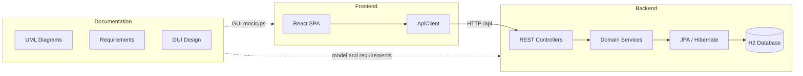

# ScoutForce

ScoutForce is a system supporting basketball scouts in the context of the NBA. It organizes the player observation cycle, from browsing the watched players list, through analyzing matches and statistics, to creating scouting reports with multidimensional ratings and draft recommendations.

The project consists of three main elements:

| Element | Path | Technologies |
|---------|---------|-------------|
| [Documentation](#documentation) | [docs/](docs/) | Typst, UML, Python |
| [Backend](#backend) | [backend/](backend/) | Java 17, Spring Boot 3, JPA, H2 |
| [Frontend](#frontend) | [frontend/](frontend/) | React 18, TypeScript, Vite, Tailwind CSS |

---

## Table of Contents

- [Architecture](#architecture)
- [Quick start](#quick-start)
- [Documentation](#documentation)
- [Backend](#backend)
- [Frontend](#frontend)
- [Repository structure](#repository-structure)
- [Use cases](#use-cases)

---

## Architecture

The application operates in a client-server model: the frontend (SPA) communicates with the backend via a REST API. Business data is persisted in an embedded H2 database. The design documentation describes the domain model and flows independently of the implementation layer.



---

## Quick start

### Prerequisites

* **Java 17+** and Maven (or the ./mvnw wrapper in the backend/ directory)
* **Node.js 18+** and npm
* *(optional, for documentation)* [Typst](https://typst.app/) and Python 3

### 1. Run the backend

```bash
cd backend
./mvnw spring-boot:run

```

The server starts at http://localhost:8080. H2 Console: http://localhost:8080/h2-console (JDBC URL: jdbc:h2:file:./data/scoutforce).

### 2. Run the frontend

```bash
cd frontend
npm install
npm run dev

```

The application is available at the address indicated by Vite (default http://localhost:5173). The API address is configured via the VITE_API_BASE_URL variable in the frontend/.env file (default http://localhost:8080).

### 3. Generate PDF documentation *(optional)*

```bash
cd docs/mas-dokumentacja
python compile_docs.py

```

---

## Documentation

**Path:** [docs/](https://www.google.com/search?q=docs/)

The design documentation was prepared as part of the MAS (System Modeling and Analysis) course and serves as a formal description of the ScoutForce system — from user requirements to implementation class diagrams and interface design.

### Contents

| File / directory | Description |
| --- | --- |
| [docs/mas-dokumentacja/](https://www.google.com/search?q=docs/mas-dokumentacja/) | Main design documentation in [Typst](https://typst.app/) format |
| [docs/mas-dokumentacja/main.typ](https://www.google.com/search?q=docs/mas-dokumentacja/main.typ) | Main file linking all chapters |
| [docs/mas-dokumentacja/contents/](https://www.google.com/search?q=docs/mas-dokumentacja/contents/) | Individual documentation chapters |
| [docs/mas-dokumentacja/assets/](https://www.google.com/search?q=docs/mas-dokumentacja/assets/) | UML diagrams (SVG) and GUI screenshots |
| [docs/mas-dokumentacja/compile_docs.py](https://www.google.com/search?q=docs/mas-dokumentacja/compile_docs.py) | PDF compilation script |
| [docs/requirements/](https://www.google.com/search?q=docs/requirements/) | Guidelines and documentation requirement checklist |

### Documentation chapters

1. **Introduction** — problem domain, system objective, users (Scout, Director), naming conventions
2. **User requirements** — user stories describing the work of a scout and sports director
3. **Use case diagrams** — functional requirements in UML notation
4. **Non-functional requirements** — performance, technology, usability
5. **Analytical class diagram** — conceptual domain model (12–15 business classes)
6. **Design class diagram** — implementation model with methods resulting from dynamic analysis
7. **Use case scenario** — detailed scenario for a non-trivial UC with «include» / «extend» relationships
8. **Activity diagram** — graphical form of a selected scenario
9. **State diagram** — state changes for a selected class (e.g., player status)
10. **GUI design** — interface mockups with navigation based on many-to-many associations (Scout → Player → Match)
11. **Design decisions** — justification of architectural choices and dynamic analysis results

---

## Backend

**Path:** [backend/](https://www.google.com/search?q=backend/)

The backend is a REST service based on Spring Boot 3 and Spring Data JPA. It is responsible for business logic, validation of domain rules, data persistence, and providing an API for the frontend.

### Technology stack

* Java 17
* Spring Boot 3.3 (Web, Data JPA, Validation, DevTools)
* Hibernate + H2 (file-based database in ./data/scoutforce)
* Lombok

### Application layers

```
backend/src/main/java/pl/s30331/ScoutForce/
├── controller/        # REST API + DTO
├── service/           # Use case logic
├── model/             # JPA entities and domain enums
├── repository/        # Spring Data repositories
├── exception/         # GlobalExceptionHandler
└── DataInitializer.java   # Startup data (demo scout, players, matches)

```

### Domain model

Main business classes:

| Class | Responsibility |
| --- | --- |
| Person | Base class for people in the system |
| Scout | Scout — observes matches, creates reports |
| Director | Sports director — manages delegations |
| Club | Basketball club |
| Player | Player with status in the scouting process |
| Match | Match with result and participants |
| MatchStats | Player's box-score statistics in a match |
| ScoutingReport | Scouting report with final rating |
| DetailedRating | Detailed rating within a report |
| Delegation | Scouting delegation for a match |
| ShootingAnalysis | Shooting analysis per court zone |
| UniversityExperience / ProfessionalExperience | Player experience |

---

## Frontend

**Path:** [frontend/](https://www.google.com/search?q=frontend/)

The frontend is a single-page application (SPA) built with React and TypeScript. It reflects the GUI design from the documentation — a two-panel layout with a player list on the left and dynamic content on the right.

### Technology stack

* React 18 + TypeScript
* Vite (bundler and dev server)
* Tailwind CSS (styling)
* Lucide React (icons)

### Code structure

```
frontend/src/
├── App.tsx             # View and application state orchestrator
├── api/
│   ├── client.ts           # HTTP client (fetch + timeout)
│   ├── adapters.ts         # Mapping DTO → UI types
│   ├── dto.ts              # Backend response types
│   └── config.ts           # API URL and demo constants
├── components/             # View and UI components
│   ├── PlayerListItem.tsx      # Player list element (Pane A)
│   ├── PlayerDetailView.tsx    # Player details + KPI
│   ├── PlayerMatchesView.tsx   # Match list with subset selection
│   ├── CreateReportView.tsx    # Scouting report form
│   ├── ReportSuccessView.tsx   # Report save confirmation
│   ├── MatchCard.tsx           # Match card with statistics
│   ├── DetailedRatingRow.tsx   # Detailed rating row
│   ├── RecommendationCard.tsx  # Draft recommendation selection
│   ├── KPITile.tsx / StatChip.tsx  # Statistics visualization
│   ├── Modal.tsx               # Report cancellation dialog
│   ├── Toast.tsx               # Notifications
│   └── EmptyState.tsx          # Empty / loading / error states
└── types/domain.ts         # UI types (UiPlayer, UiMatch, View, …)

```

---

## Repository structure

```
ScoutForce/
├── README.md               ← this file
├── docs/
│   ├── mas-dokumentacja/     ← MAS documentation (Typst + PDF)
│   └── requirements/         ← documentation guidelines
├── backend/
│   ├── src/main/java/        ← Spring Boot source code
│   ├── src/main/resources/   ← application.properties
│   ├── src/test/             ← tests
│   ├── pom.xml
│   └── mvnw / mvnw.cmd
└── frontend/
    ├── src/                ← React source code
    ├── package.json
    ├── vite.config.ts
    └── tailwind.config.js

```

---

## Use cases

The following use cases are implemented in the current version of the application (frontend + backend):

| Use case | Implementation |
| --- | --- |
| View Players List | List in the left panel; GET /api/scouts/{id}/players |
| View Player's Matches | Match view; GET /api/scouts/{id}/players/{id}/matches |
| Create Scouting Report | Report form; POST .../reports or POST .../reports/from-matches |
| Add Detailed Ratings | Rating section in CreateReportView; part of POST payload |
